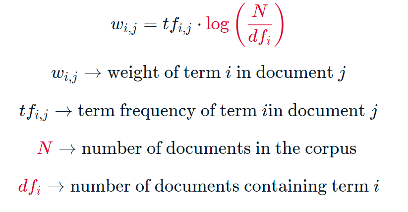
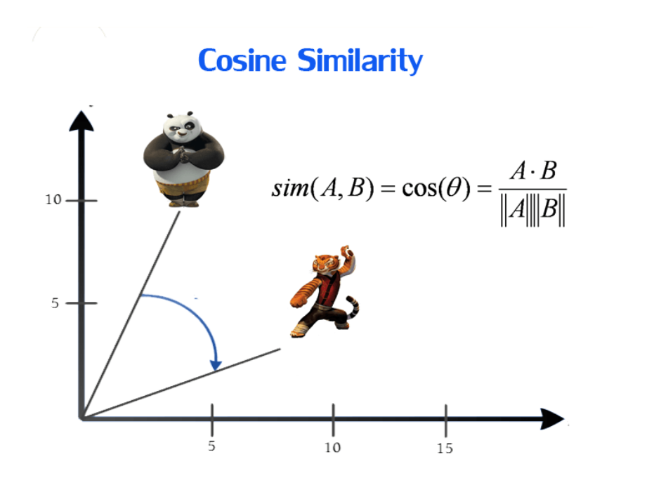

README
================

# Como comparar documentos utilizando ténicas de NLP ?

Responder essa pergunta pode ser importante para recomendações de filmes
no Netflix ou para integração de dados a partir de descrições de
produtos semelhantes, por exemplo. E muitas outras coisas, é claro.

Uma possível resposta para esse problema é utilizar técnicas de
vetorização de texto, combinando tf-idf e similaridade de cossenos.

### Term frequency-inverse document frequency (TF-IDF)

TF-IDF é apenas uma forma de medir a importância relativa dos tokens no
texto, transformando um documento em uma lista de números. Isso é
importante, pois para calcular a similaridade de cosseno, você precisa
de dois vetores de documento ou, simplesmente, “vetorizar” o texto.

Por outras palavras, tf-idf é uma transformação que você aplica a textos
para obter dois vetores de valor real e, dessa forma, conseguir aplicar
a métrica de similaridade. Ele informa a importância relativa de uma
palavra ou token em um documento. Se uma string aparece muitas vezes em
um documento e raras vezes em outro documento, então ela deve receber um
peso maior, pois caracteriza esse documento.

Matematicamente, temos:



Exemplo: Em um documento qualquer, a string ‘coca-cola lata 350 ml’
aparece 5 vezes. Temos, ao todo, 20 documentos e o termo ‘coca-cola lata
350 ml’ aparece também em 8 deles. Então, o peso tf-idf dessa palavra na
representação vetorial deste documento será 5\*log(20/8). Em geral,
quanto maior o peso tf-idf, mais importante é a palavra na
caracterização do documento. Por outro lado, se uma palavra aparece n
vezes em um documento, mas também está presente em todos os outros
documentos, então o peso tf-idf para essa palavra em cada documento será
zero.

> Em geral, quanto maior o peso tf-idf, mais importante é a palavra na
> caracterização do documento.

### Similaridade de cosseno

Uma vez que já temos o texto vetorizado podemos aplicar a similaridade
de cosseno, uma das métricas de similaridade mais populares em NLP. Como
o próprio nome já revela, a similaridade é dada pela cosseno do ângulo
entre os vetores.

Em álgebra linear, o prdouto vetorial de dois vetores é igual ao módulo
de cada vetor multiplicado pelo cosseno do ângulo formado entre os
vetores. Logo, cosseno do ângulo é o produto escalar divido pela sua
norma (vide imagem). A norma é essencialmente o comprimento do vetor.
Matematicamente, é definido como a raiz quadrada da soma dos quadrados
dos valores em todas as dimensões de um vetor.



Sejam dois vetories A e B, em que A:(4,7,1) e B:(5,2,3). Então, o
produto escalar dos vetores será dado por

e o produto da magnitude dos dois vetores será dado por


Em NLP, os vetores de documento quase sempre utilizam pesos não
negativos. Logo, o ângulo somente pode variar de 0 a 90 graus ou
cos(0º)=1 e cos(90º)=0, onde 1 indica que os documentos são idênticos e
zero que não há semelhança entre os documentos.

> Em NLP, the cosine score varia entre 0 e 1, onde 0 indica nenhuma
> semelhança e 1 indica que os documentos são idênticos.

### Implementação utilizando o scikit-learn

Uma maneira de aplicar a teoria é através de um sistema de recomendação
que sugere filmes com base na similaridade de enredos. Nossa tarefa é
construir uma função que receba o título de um filme e produza uma lista
de filmes com enredos semelhantes. Por exemplo, se um usuário do Netflix
um belo dia asssite um dos meus filmes favoritos *High Plains Drifter*
(1973) de Clint Eastwood é esperado que outros fimes sobre faroeste,
bandidos ou mortes sejam sugeridos em seguida.

A função de recomendação possui, basicamnete, 03 argumentos: o título do
filme, a matriz de similaridade de cosseno e uma série de índices. A
função extrai as pontuações de semelhança de cosseno par a par de um
filme com todos os outros filmes do dataset. Em seguida, ela classifica
essas pontuações em ordem decrescente. Finalmente, ela produz os títulos
dos filmes correspondentes às pontuações mais altas de similaridade.
Observe que a função ignora a pontuação de similaridade mais alta (score
= 1). Isso ocorre porque o filme mais semelhante a um determinado filme
é o próprio filme!

**Uma dica é substituir a função cosine_similarity por linear_kernel. A
saída permanece a mesma, mas leva muito menos tempo para calcular.** A
diferença no tempo de execução entre as duas funções foi pequena (0.357
v. 0.339 seconds), porém quando se está trabalhando com grande volume de
dados e seus vetores estão na representação tf-idf, é uma boa prática
utilizar linear_kernel para obter um melhor desempenho.

``` python
import pandas as pd
import numpy as np
from sklearn.feature_extraction.text  import  TfidfVectorizer
from sklearn.metrics.pairwise import linear_kernel

# Importar dataset
metadata = pd.read_csv('data/movie_overviews.csv').dropna()
metadata.head()


indices = pd.Series(metadata.index, index=metadata['title']).drop_duplicates()

def get_recommendations(title, cosine_sim, indices):
    # Obter o índice do filme que corresponde ao título
    idx = indices[title]
    # Obter o score de similaridade
    sim_scores = list(enumerate(cosine_sim[idx]))
    # Classificar os filmes com base no score de similaridade
    sim_scores = sorted(sim_scores, key=lambda x: x[1], reverse=True)
    # Obter o score dos 10 filmes mais semelhantes
    sim_scores = sim_scores[1:11]
    # Obter os índices de filmes
    movie_indices = [i[0] for i in sim_scores]
    # Retorna os 10 filmes mais parecidos
    return metadata['title'].iloc[movie_indices]


movie_plots = metadata['overview']


tfidf = TfidfVectorizer(stop_words='english')

# Construir a matriz TF-IDF
tfidf_matrix = tfidf.fit_transform(movie_plots)

# Gerar a matriz de similaridade de cosseno
cosine_sim = linear_kernel(tfidf_matrix, tfidf_matrix)

# Gerar recomendações de filmes
print(get_recommendations("High Plains Drifter", cosine_sim, indices))
```
